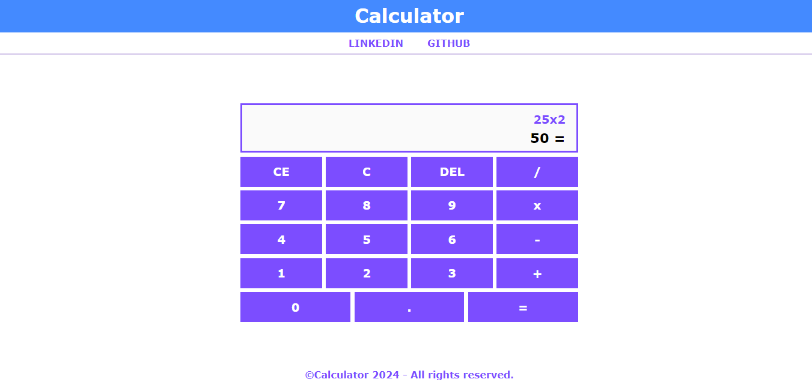
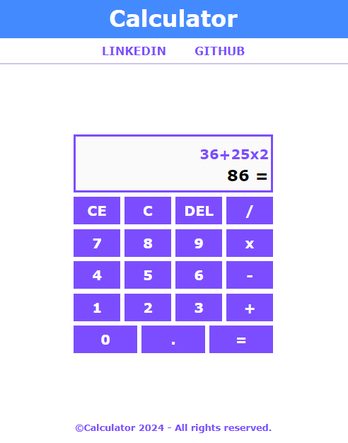

# **Calculator**

## Sobre o projeto

Projeto: [Clique e acesse o projeto em Angular](https://)

Trabalho realizado com o framework React Js, com uso de Typescript, HTML5, CSS3 e Flexbox. 

Calculadora que faz os cálculos básicos da matemática, como: soma, subtração, multiplicação e divisão; e configurada para evitar erros. A mesma se adapta em desktop e mobile. Para fazer os cálculos a partir de uma string utilizei a função EVAL do javascript.

Trabalhei com componentes de cabeçalho, de rodapé e de conteúdo; dividindo as responsabilidades.

 

Work carried out with the React Js framework, using Typescript, HTML5, CSS3 and Flexbox.

Calculator that performs basic mathematics calculations, such as: addition, subtraction, multiplication and division; and configured to avoid errors. It adapts to desktop and mobile. To do the calculations from a string I used the JavaScript EVAL function.

I worked with header, footer and content components; dividing responsibilities.

## Layout Web

## Tecnologias Utilizadas

* HTML5
* CSS3
* Flexbox
* Typescript
* React Js

## Instalar

##### Instalar Dependências
<pre><code>npm install</code></pre>

##### Executar Aplicação
<pre><code>npm run dev</code></pre>

## Autor

#### **Katarine Albuquerque**

    
    &nbsp;
    

